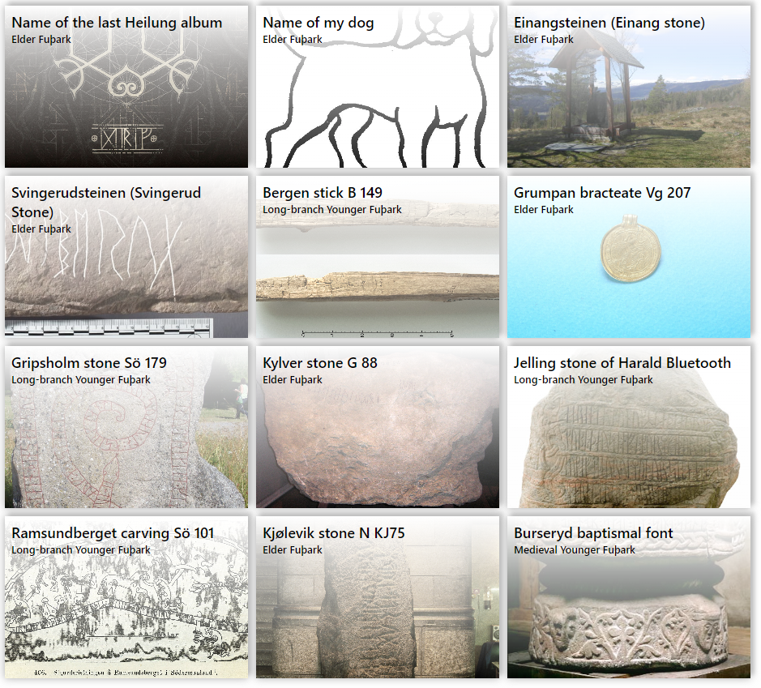
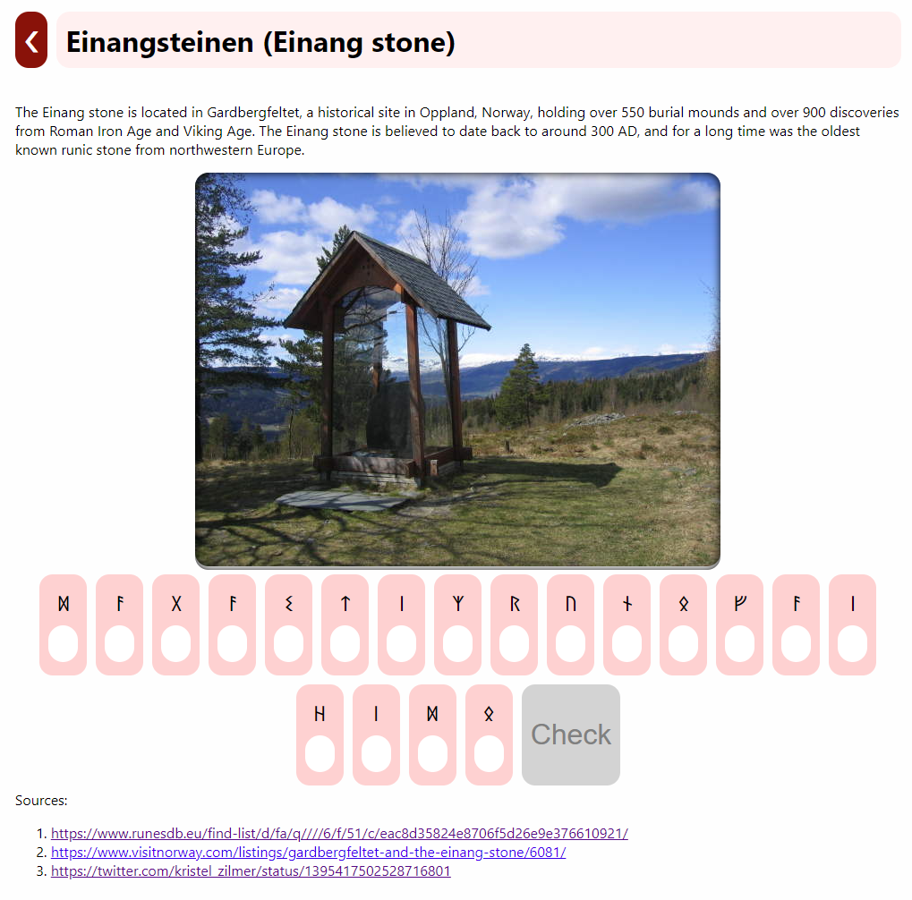
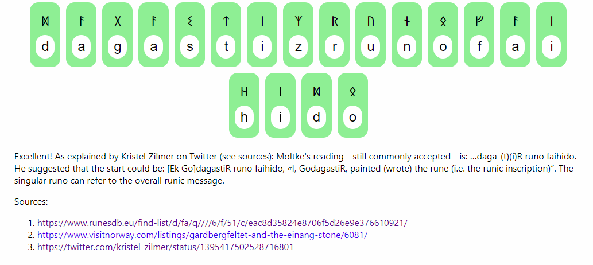

# rune-ovningsbok

## Rune Övningsbok web app

This web app is currently under development. It will be a simple service for
practicing rune transliteration with some well-known runic findings.

## About
The user will pick one of the well-known runic inscriptions that they want to practice transliteration on:

A single exercise consists of a short description of the object, a photo and a row of runes to transliterate:

After successful transliteration, a short explanation of the meaning of the message is displayed:

Before releasing this app, I still want to improve the experience and build up a bigger database of exercises. Ideally, I'd also like to gather some early feedback from someone who is better versed in Scandinavian writing systems.

Feel free to file an [Issue](https://github.com/tomaszgarbus/rune-ovningsbok/issues) for any feature I should add.

## Credits

This project uses [Junicode font](https://junicode.sourceforge.io).