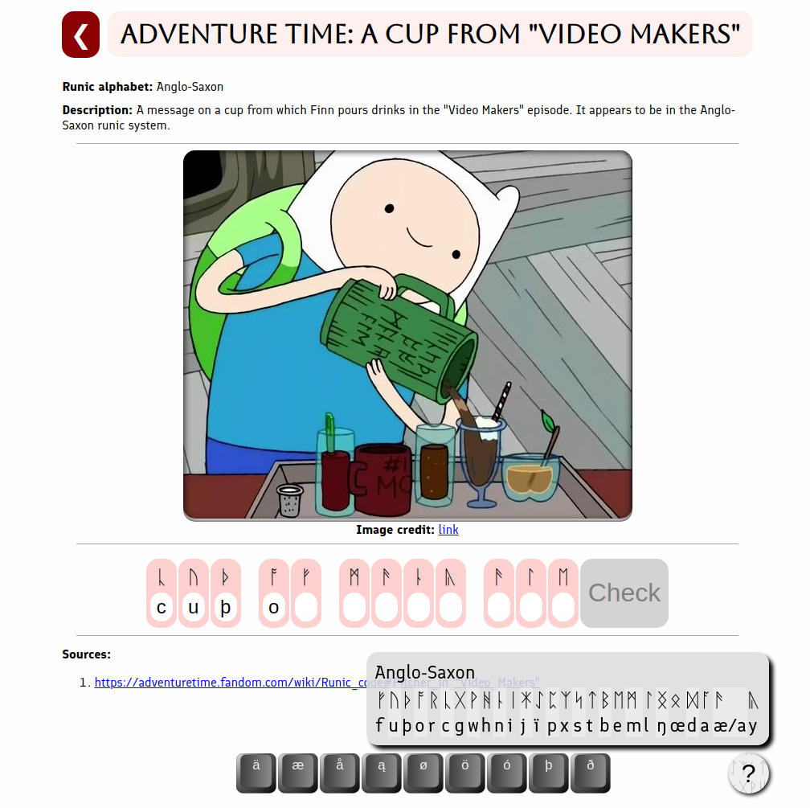

# Rune transliteration practice app

## [Try it out!](https://tomaszgarbus.github.io/rune-ovningsbok)

## About

Use real runic inscriptions, both historical and from popular culture, to practice transliteration.

Ideally, I would like to become a collaborative effort where more enthusiasts would contribute and review each others' content.

## Example
Consider this screenshot of a popular cartoon Adventure Time, where Finn is pouring a liquid from a mug with a mysterious Anglo-Saxon inscription.

Under each runic symbol, there is a field to transliterate it to a latin character. For convenience, you can navigate with arrows between symbols as well as automatically jump to the next one.

At the bottom, there is a mini virtual keyboard with regional characters. In the bottom right, you can also open a cheat sheet.

## Contributions

Contributions are very much welcome!

Here's how you can help grow the app:

### As a developer/UI&UX designer:
* Directly contribute code.
* Improve test coverage.
* Provide mocks or sketches for better UI.

### As a scholar/expert on runes:
* Review existing content.
* Provide better sources.
* Submit new content (feel free to submit in any format, I'll be happy to convert to jsons).

### As a user:
* File an [issue](https://github.com/tomaszgarbus/rune-ovningsbok/issues) with your suggestions.

## Stack
* ReactJS
* Node.js

### Getting started with the repo

1. Clone the repository: `git clone https://github.com/tomaszgarbus/rune-ovningsbok`
1. `cd` into `rune-ovningsbok`
1. Install Node dependencies: `npm install`
1. To run the tests: `npm test -- --coverage --watchAll`
1. You're good to go! Run `npm start` to run the app locally.

### Deployment to GH pages
Deployment to GH pages was set up by following [this guide](https://github.com/gitname/react-gh-pages). It suffices to run `npm run deploy` from the main directory of the repo.
